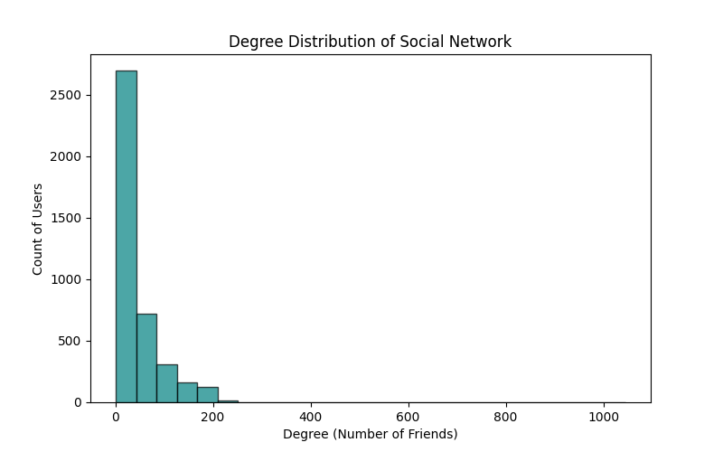
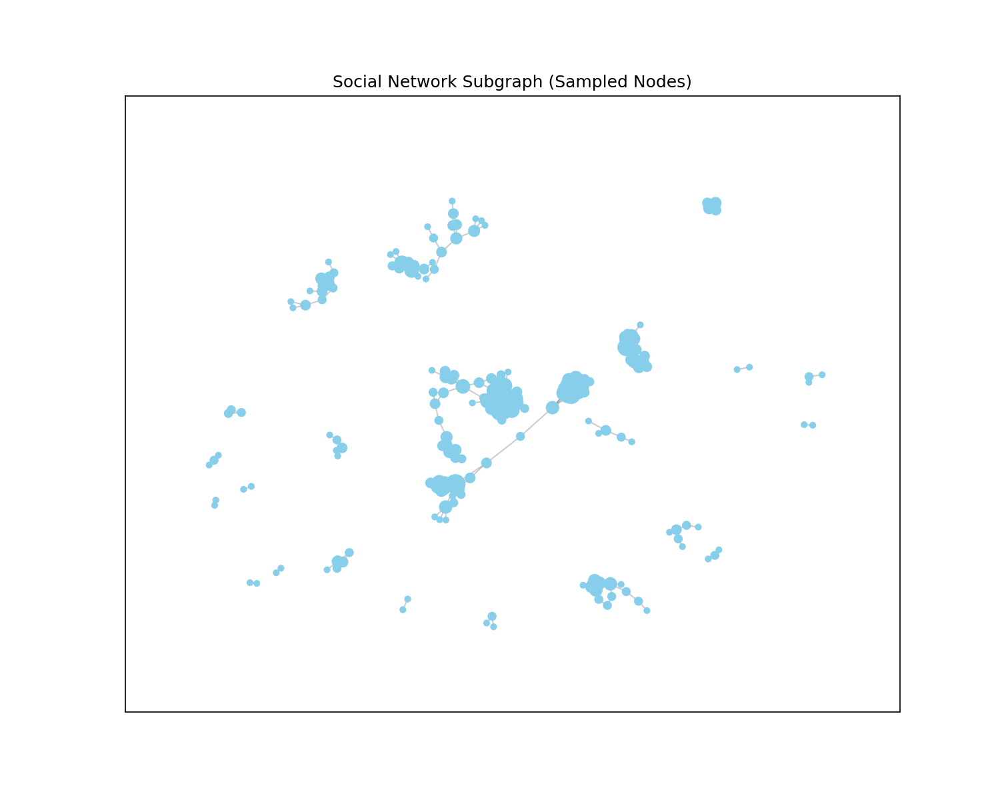
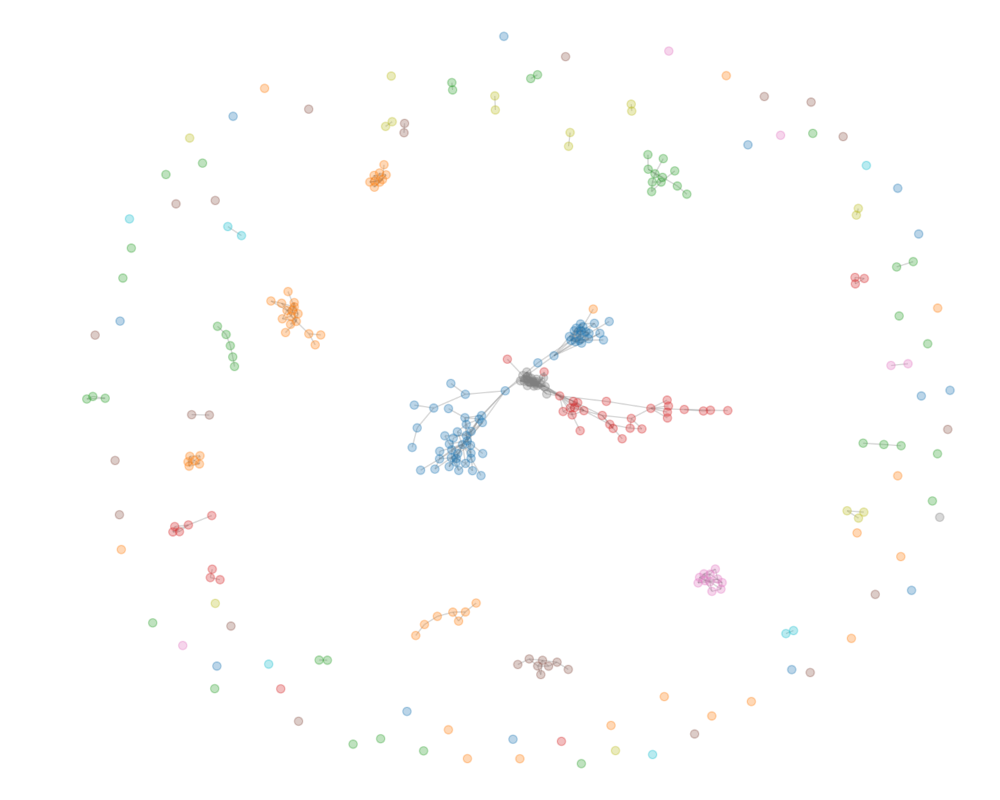

# 🌐 تحلیل گراف شبکه اجتماعی  
### Social Network Analysis (SNA)

[](https://www.python.org/)
[](https://networkx.org/)
[](https://matplotlib.org/)
[](https://snap.stanford.edu/data/ego-Facebook.html)
[]()

> پروژه نهایی درس **ریاضیات گسسته**  
> تحلیل ساختار یک شبکه اجتماعی واقعی با استفاده از نظریه گراف، الگوریتم‌های پیمایش، معیارهای مرکزیت، تشخیص اجتماع و بصری‌سازی داده‌ها.

---

## فهرست مطالب
- [معرفی پروژه](#معرفی-پروژه)
- [ویژگی‌ها](#ویژگیها)
- [اعضای تیم](#اعضای-تیم)
- [دیتاست استفاده‌شده](#دیتاست-استفادهشده)
- [ساختار پروژه](#ساختار-پروژه)
- [الگوریتم‌ها و تحلیل‌ها](#الگوریتمها-و-تحلیلها)
- [نحوه اجرا](#نحوه-اجرا)
- [خروجی‌ها](#خروجیها)
- [نمونه نتایج](#نمونه-نتایج)
- [تست‌ها](#تستها)
- [نکات مهم](#نکات-مهم)
- [اعتبار علمی](#اعتبار-علمی)
- [توسعه‌های آینده](#توسعههای-آینده)
- [جمع‌بندی](#جمعبندی)

---

## معرفی پروژه
این پروژه برای تحلیل یک **شبکه اجتماعی واقعی** طراحی شده است تا بتواند ساختار ارتباطی کاربران را با ابزارهای ریاضیات گسسته و علوم داده بررسی کند.

در این پروژه، گراف اجتماعی از یک دیتاست معتبر **SNAP Stanford** ساخته شده و سپس عملیات‌های زیر روی آن انجام می‌شود:

- پیمایش گراف با BFS و DFS
- یافتن کوتاه‌ترین مسیر با BFS و Dijkstra
- تحلیل مرکزیت گره‌ها
- تشخیص اجتماع‌ها (Communities)
- بررسی خاصیت Small-World
- پیش‌بینی یال‌های آینده با معیار Jaccard
- رسم نمودارهای تحلیلی و ذخیره خروجی‌ها

---

## ویژگی‌ها
- پیاده‌سازی ساختار گراف از صفر با Python
- بارگذاری دیتاست واقعی از فایل CSV
- پشتیبانی از گراف بدون‌جهت
- اجرای الگوریتم‌های کلاسیک گراف
- تحلیل پیشرفته شبکه اجتماعی
- تولید نمودارهای آماری و تصویری
- ساختار ماژولار و تمیز برای توسعه و تست
- مناسب برای ارائه دانشگاهی و مستندسازی فنی

---

## اعضای تیم
| نام | نقش |
| --- | --- |
| **آلان حاتمی** | مدیریت پروژه، تحلیل پیشرفته، یکپارچه‌سازی و بصری‌سازی |
| **سبحان رئیسی** | پیاده‌سازی ساختار داده گراف و پیمایش‌های BFS / DFS |
| **محمدمهدی قادری** | پیاده‌سازی Dijkstra، تحلیل‌های عددی و معیارهای مرکزیت |

---

## دیتاست استفاده‌شده
در این پروژه از دیتاست واقعی و معتبر زیر استفاده شده است:

- **نام دیتاست:** `ego-Facebook`
- **منبع:** Stanford SNAP
- **نوع:** شبکه اجتماعی
- **تعداد گره‌ها:** `4039`
- **تعداد یال‌ها:** `88234`

فایل داده در مسیر زیر قرار دارد:

```text
data/social_network.csv
```

فرمت فایل:

```csv
source,target
0,1
0,2
1,2
...
```

---

## ساختار پروژه
ساختار نهایی پروژه به شکل زیر است:

```text
social-network-analysis/
├── src/
│   ├── main.py
│   ├── graph_manager.py
│   ├── algorithms.py
│   └── analyzer.py
├── data/
│   └── social_network.csv
├── docs/
│   ├── dataset.md
│   └── report.md
├── benchmarks/
│   ├── degree_distribution.png
│   ├── network_plot.png
│   └── communities.png
├── tests/
└── README.md
```

---

## الگوریتم‌ها و تحلیل‌ها

### 1) ساخت گراف
کلاس `SocialGraph` مسئول:
- اضافه‌کردن گره
- اضافه‌کردن یال
- ذخیره‌سازی adjacency list
- بارگذاری داده از CSV

### 2) BFS
برای:
- پیمایش سطحی گراف
- یافتن کوتاه‌ترین مسیر در گراف بدون‌وزن

### 3) DFS
برای:
- پیمایش عمقی
- بررسی ساختار اتصال در شبکه

### 4) Dijkstra
برای:
- محاسبه کوتاه‌ترین مسیر
- استفاده آموزشی در مقایسه با BFS

### 5) Degree Centrality
برای:
- شناسایی گره‌های مهم و پراتصال

### 6) Community Detection
برای:
- پیدا کردن خوشه‌ها و گروه‌های اجتماعی متراکم

### 7) Small-World Analysis
برای:
- مقایسه ضریب خوشه‌بندی گراف واقعی با گراف تصادفی

### 8) Link Prediction
برای:
- پیش‌بینی ارتباط‌های احتمالی آینده با معیار Jaccard

---

## نحوه اجرا

### پیش‌نیازها
قبل از اجرا، مطمئن شوید Python نصب است و سپس وابستگی‌های زیر را نصب کنید:

```bash
pip install networkx matplotlib pandas
```

### اجرای پروژه
حتماً برنامه را از **ریشه پروژه** اجرا کنید:

```bash
python src/main.py
```

---

## خروجی‌ها
پس از اجرای موفق برنامه، فایل‌های زیر در پوشه `benchmarks/` ساخته می‌شوند:

- `degree_distribution.png`  
  نمودار توزیع درجه گره‌ها

- `network_plot.png`  
  نمایش تصویری یک زیرگراف نمونه

- `communities.png`  
  نمایش خوشه‌ها و اجتماع‌های تشخیص‌داده‌شده

---

## نمونه نتایج
در اجرای نهایی پروژه روی دیتاست `ego-Facebook` نتایج زیر به‌دست آمد:

| شاخص | مقدار |
| --- | ---: |
| Nodes | `4039` |
| Edges | `88234` |
| Clustering Coefficient (Actual) | `0.6055` |
| Clustering Coefficient (Random Graph) | `0.0108` |
| Detected Communities | `13` |

این نتایج نشان می‌دهد که شبکه مورد بررسی دارای ویژگی‌های مهم شبکه‌های اجتماعی واقعی است و از نظر ساختاری، رفتار **Small-World** دارد.

---

## تصاویر خروجی

### توزیع درجه
<p align="center">
  
  <br>
  <em>شکل ۱: توزیع درجه گره‌ها در شبکه اجتماعی فیس‌بوک</em>
</p>

### نمایش نمونه‌ای از شبکه
<p align="center">
  
  <br>
  <em>شکل ۲: زیرنمودار نمونه استخراج‌شده جهت بصری‌سازی ساختار شبکه</em>
</p>

### تشخیص جوامع
<p align="center">
  
  <br>
  <em>شکل ۳: خوشه‌بندی و شناسایی جوامع درون شبکه با الگوریتم لووین</em>
</p>


---

## تست‌ها
برای اعتبارسنجی بخش‌های اصلی پروژه می‌توانید موارد زیر را بررسی کنید:

- بارگذاری صحیح فایل CSV
- صحت اضافه شدن گره‌ها و یال‌ها
- خروجی BFS و DFS
- کوتاه‌ترین مسیر با Dijkstra
- تولید صحیح فایل‌های تصویری
- اجرای بدون خطا از مسیر ریشه پروژه

اگر در پروژه فایل تست دارید، می‌توانید آن را از مسیر `tests/` اجرا کنید.

---

## نکات مهم
- برنامه را **فقط از ریشه پروژه** اجرا کنید.
- مسیر دیتاست باید دقیقاً `data/social_network.csv` باشد.
- اگر پوشه `benchmarks/` وجود نداشت، برنامه باید آن را بسازد.
- فایل CSV باید دارای دو ستون `source` و `target` باشد.
- برای جلوگیری از کندی، رسم گراف روی یک **زیرگراف نمونه‌برداری‌شده** انجام می‌شود.

---

## اعتبار علمی
این پروژه بر پایه مفاهیم زیر طراحی شده است:

- نظریه گراف
- الگوریتم‌های جست‌وجو و مسیر‌یابی
- تحلیل شبکه‌های پیچیده
- معیارهای مرکزیت
- خوشه‌بندی و تشخیص اجتماع
- ویژگی‌های Small-World
- پیش‌بینی پیوند در شبکه‌های اجتماعی

منبع داده نیز از یک دیتاست واقعی و معتبر انتخاب شده تا تحلیل‌ها از نظر علمی قابل استناد باشند.

---

## توسعه‌های آینده
اگر بخواهید پروژه را گسترش دهید، می‌توانید موارد زیر را هم اضافه کنید:

- PageRank
- Betweenness Centrality
- Closeness Centrality
- رسم histogram پیشرفته‌تر
- تحلیل connected components
- export خروجی JSON
- رابط کاربری گرافیکی

---

## جمع‌بندی
این پروژه یک نمونه‌ی کامل از ترکیب **ریاضیات گسسته، برنامه‌نویسی پایتون، تحلیل داده و مهندسی نرم‌افزار** است.  
هدف اصلی آن، ارائه‌ی یک تحلیل تمیز، علمی، قابل فهم و قابل ارائه از یک شبکه اجتماعی واقعی بوده است.

> ساخته شده با دقت، تحلیل و عشق به گراف‌ها و شبکه‌ها.